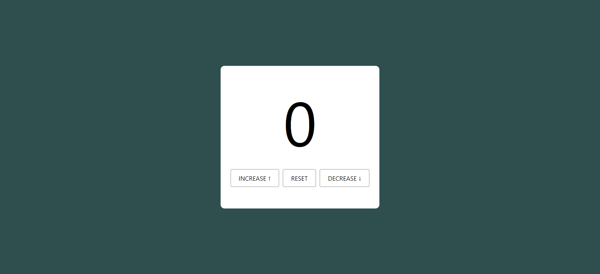

# Counter App

A simple counter application built with React.js. This app allows users to increase, decrease, and reset a counter value.

## Features

- Increase the counter value
- Decrease the counter value (cannot go below 0)
- Reset the counter value to 0

## Demo



## Installation

1. Clone the repository:

   ```bash
   git clone https://github.com/ShashikantBharti/my_react_projects/tree/main/counter-app
   cd weather-app
   ```

2. Install the dependencies:

   ```bash
   npm install
   ```

3. Start the development server:
   ```bash
   npm run dev
   ```

## Usage

1. Open the app in your browser:

   ```
   http://localhost:5173
   ```

2. To increase value click on "Increase".

3. To decrease value click on "Decrease".

4. To reset value click on "Reset".

## Code Structure

- `src/App.js`: The main component.
- `src/App.css`: Styling for the Weather component.

## Dependencies

- [React](https://reactjs.org/)

## License

This project is licensed under the MIT License. See the [LICENSE](LICENSE) file for details.

## Acknowledgements

- [Create React App](https://create-react-app.dev/) for the React boilerplate.

## Contributing

Contributions are welcome! Please open an issue or submit a pull request for any changes or improvements.

## Contact

For any inquiries, please contact [shashikant.dev247@gmail.com](mailto:shashikant.dev247@gmail.com).
