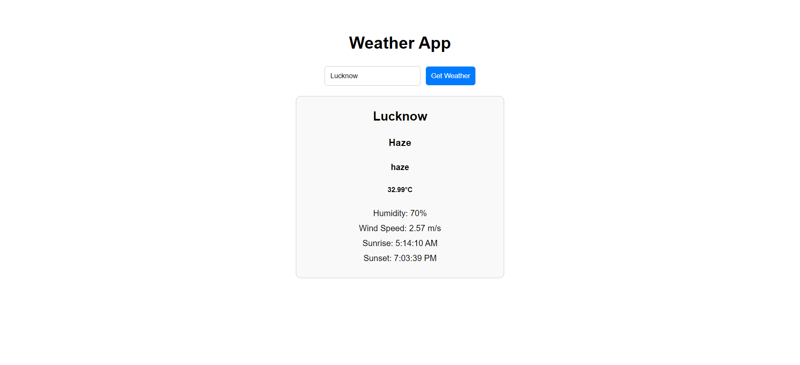

# Weather App

A simple weather app built with React.js that allows users to get the current weather information for any city.

## Features

- Search for weather by city
- Display current temperature, weather condition, humidity, wind speed, sunrise, and sunset times
- Responsive and user-friendly interface

## Demo



## Installation

1. Clone the repository:

   ```bash
   git clone https://github.com/ShashikantBharti/weather-app.git
   cd weather-app
   ```

2. Install the dependencies:

   ```bash
   npm install
   ```

3. Create a `.env` file in the root of your project and add your OpenWeatherMap API key:

   ```
   REACT_APP_API_KEY=your_openweathermap_api_key
   ```

4. Start the development server:
   ```bash
   npm run dev
   ```

## Usage

1. Open the app in your browser:

   ```
   http://localhost:5173
   ```

2. Enter the name of a city in the search bar and click "Get Weather".

3. The current weather information for the entered city, including sunrise and sunset times, will be displayed.

## Code Structure

- `src/App.js`: The main component that integrates the Weather component.
- `src/App.css`: Styling for the Weather component.

## Dependencies

- [React](https://reactjs.org/)

## API

This project uses the [OpenWeatherMap API](https://openweathermap.org/api) to fetch weather data. You need to sign up for an API key and add it to your `.env` file.

## License

This project is licensed under the MIT License. See the [LICENSE](LICENSE) file for details.

## Acknowledgements

- [OpenWeatherMap](https://openweathermap.org/) for providing the weather data API.

## Contributing

Contributions are welcome! Please open an issue or submit a pull request for any changes or improvements.

## Contact

For any inquiries, please contact [shashikant.dev247@gmail.com](mailto:shashikant.dev247@gmail.com).
